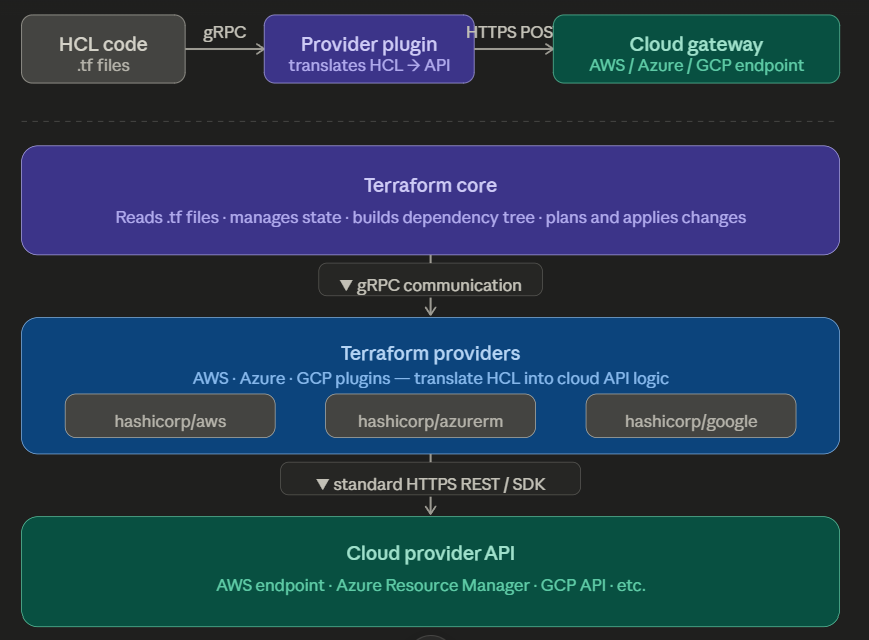

Terraform is a Orchestration tool helps to create the infra, using the HCL (HarshiCrop Configuration Language). 

Terraform communicates with cloud providers through an API-driven plugin architecture [aws-provider, Azure, GCP,..]. It translates your static configuration code into dynamic API requests that cloud networks understand. In simple terms when we run the code terraform with the help of provider, makes the API calls to the Cloud providers API endpoint and create resources. 

How the Components Communicate:

1. Internal RPC Link: Terraform Core launches the provider plugins as separate background processes on your machine. Core talks to these plugins over an internal network channel using gRPC (Google Remote Procedure Calls).
2. External HTTPS/REST Calls: The provider plugin takes the generic commands from Core (e.g., "Create a Resource") and wraps them inside the cloud vendor's official Go Software Development Kit (SDK). The plugin then opens an encrypted HTTPS connection over the public internet to the cloud provider's official REST API endpoints.

Step-by-Step API Interaction (An Example)When you run terraform apply to build a virtual server, this is the exact technical chain reaction:

[HCL Code] ──> (gRPC) ──> [Provider Plugin] ──> (HTTPS POST) ──> [Cloud Gateway]

Step 1 (The Order): Core reads your resource block, determines its place in the dependency tree, and sends a gRPC payload to the provider plugin: "Hey AWS Provider, create an ec2_instance with these configurations."
Step 2 (The Translation): The AWS Provider plugin translates that request into the specific Go SDK code required by Amazon.
Step 3 (The Network Request): The plugin issues a secure network request (typically an HTTP POST or PUT) directly to the AWS API endpoint (e.g., https://amazonaws.com).
Step 4 (Authentication): The request passes along your cloud credentials (which you configured via environment variables or shared credentials files) inside the HTTP request headers to authenticate and authorize the action.
Step 5 (The Response): The cloud provider processes the request, builds the physical or virtual hardware, and replies with an HTTP 200 OK or 201 Created status code, alongside a JSON payload containing the server's tracking details (IDs, public IPs, and MAC addresses).
Step 6 (Saving to State): The provider plugin hands these IDs back to Core via gRPC, and Core writes them securely into your terraform.tfstate file.

Important topics that we need to be aware of:

Provider: These act as the translation layer between Terraform and cloud APIs. These are separate executables (plugins) built specifically for each platform (e.g., AWS Provider, Azure Provider). Plugins contain the specific logic required to interact with that platform's systems.

Resources: Creates, updates, or deletes infrastructure. Every resource has a type and a name you give it.

Anatomy of a resource block

resource  "aws_instance"  "my_server"
   ↑            ↑               ↑
keyword    resource type    your name
           (from AWS docs)  (anything you want)

data sources: Queries and fetches metadata about existing items.

state file:

lifecycle: init -> plan -> apply -> destroy
     Terraform relies on a predictable three-step operational workflow to transition your local configurations into actual running architecture. (write code -> dry run -> apply -> real infra)

     the entire configuration depends on  ".tfstate" , its the brain of the terraform. without the .tfstate state file terraform don't know the current state of configuration. any manipulation of this file will lead to no communication with the infra build with the code.

terraform.tfvars: 

output.tf: 

locals:

Remote state

S3 backend:

dynamoDB locking:

terraform remote state:

state commands:

Modules

Writing modules:

calling modules:

public registry modules:

modules structure:

secrets management:

Security

never hardcore secrets

.gitignore for state

IAM least privileage:

sensitive = true

count & for_each: create multiple resources dynamically

dynamic blocks

terraform import

terragrunt

Primary Benefits of Using Terraform
1. Multi-Cloud Capability: Manage different cloud providers seamlessly using a singular syntax and unified workflow tool.
2. No Configuration Drift: By mapping real-world infrastructure to code, it flags unauthorized manual changes next time you plan.
3. Code Reusability: Leverage Terraform Modules to package common architectural configurations (like standard VPCs) and reuse them.
4. Version Control Integration: Because infrastructure lives as plain text files, it can be version-controlled in Git, enabling pull requests and team code reviews

demerits:
1. The Risk of State File Management
Single Point of Failure: The terraform.tfstate file is the absolute source of truth. If it is corrupted, accidentally deleted, or falls out of sync with actual infrastructure, repairing it requires complex, manual intervention.

Security Exposure: State files store configuration data in plain-text JSON. This includes sensitive secrets like database passwords, private keys, and API tokens. You must secure it using encrypted remote storage backends like AWS S3 or HashiCorp Vault.

2. Steep Learning Curve and Custom Language

Proprietary Language: Terraform relies entirely on HashiCorp Configuration Language (HCL). Your team must learn its specific syntax, expression logic, and quirkier behaviors instead of using standard coding languages like Python or TypeScript.

Complex Logic Implementation: Writing advanced loops, conditional resources, and dynamic blocks in HCL is often less intuitive and harder to debug than traditional programming code.

3. "Configuration Drift" Vulnerabilities

Blind Spot to Manual Changes: Terraform only knows about infrastructure it deployed or imported. If a team member manually modifies a server setting via the cloud console, Terraform will not know until you actively run a plan or refresh.

Concurrency Locks: If two team members try to apply changes at the exact same time without proper remote state locking enabled, they can corrupt the state file or overwrite each other's changes.

4. Delayed Feature Support

Provider Dependency: Terraform relies on provider plugins to talk to cloud APIs. When AWS or Azure releases a brand-new service or feature, there is often a delay before the open-source community or HashiCorp updates the provider to support it.

Breaking Changes: Major version upgrades of Terraform or its providers can introduce breaking syntax changes, forcing teams to spend hours refactoring old code.

5. Lack of Built-in Rollbacks

No Automatic Undo: If a deployment fails halfway through terraform apply, Terraform does not automatically roll back to the previous stable state. It stops exactly where it failed, leaving you with a "partial deployment" that you must manually debug and fix.

## Project structure

project/
├── main.tf
├── variables.tf
├── outputs.tf
├── terraform.tfvars
└── backend.tf

All .tf files are committed to Git (GitHub/GitLab/Bitbucket)
Never run terraform manually from local machine in production
Changes go through Pull Requests / Code Reviews

Typical CI/CD Pipeline Flow

Developer pushes code to Git
        ↓
CI/CD triggers automatically
        ↓
terraform init
        ↓
terraform validate
        ↓
terraform plan  ← output shown for review
        ↓
Manual approval by Team Lead / Manager
        ↓
terraform apply ← runs only after approval
        ↓
Notification sent (Slack/Email)