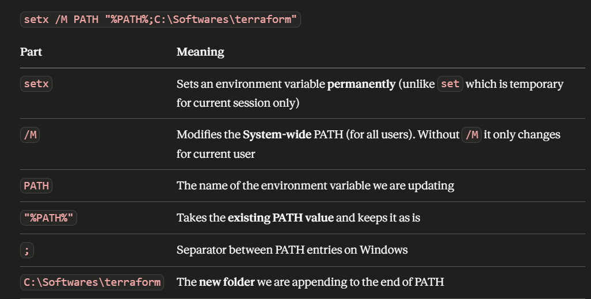

# Terraform EC2 Demo 🚀

Provisioning an AWS EC2 instance with a Security Group using Terraform.
Built on Day 1 of my IaC learning journey — including all the real errors I hit along the way.

to run the terraform in your local you just need the AWS cli and terraform.exe file in your PC. 

For the Terraform executable file:
while installing terraform in your local PC download the respective terraform.exe file and copy it to particular path. and add an env. variable in user variables, if needed we can add it in system variable. 

Incase system unable to locate the terraform.exe file. Run the below command from cmd line as admin. 




For the AWS CLI:
Download latest version cli to PC and install. 

To write the terraform code you have to know about the provider. which is a medium between AWS and Terraform. 

Comment Syntaxes
    # starts a single-line comment and is the standard convention.
    // starts an alternative single-line comment.
    /* begins and */ ends a multi-line block comment


## What this does
- Creates an EC2 instance on AWS
- Configures a Security Group with inbound/outbound rules
- Manages full infrastructure lifecycle via Terraform

## Prerequisites
- [Terraform](https://developer.hashicorp.com/terraform/install) installed
- [AWS CLI](https://aws.amazon.com/cli/) installed and configured
- AWS account with EC2 permissions

## Project structure
```
.
├── provider.tf   # AWS provider and region config
├── ec2.tf        # EC2 instance resource
└── sg.tf         # Security group rules
```

## Usage

```bash
# Initialize Terraform
terraform init   # it will generate all necessary files 

# Format and validate
terraform fmt    # Format code cleanly
terraform validate  # Check for syntax errors

# Preview changes
terraform plan -out=tfplan  # Creates binary file, which we use in automation, will discuss later. 
terraform show -json tfplan > tfplan.json # Convert binary to JSON, helps for automation, compliance scanning, and pipeline validation.
terraform plan -no-color -out=tfplan # convert to human readable
terraform show -no-color tfplan > plan_output.txt # human-readable text into documentation

# Apply infrastructure
terraform apply tfplan # to apply the changes

# Destroy all resources
terraform plan -destroy -out=destroy.tfplan  # Generate and save the destroy plan file
terraform apply destroy.tfplan # Apply the saved destroy file to tear down the infrastructure
 or 
terraform destroy -auto-approve to manually destroy without any approval. 
```

## Real issues I faced

### 1. Environment variable not working (CMD & Git Bash)
- Even after adding Env. Variable doesn't work try by this command.

    setx /M PATH "%PATH%;<path where the terraform.exe is located>" - alternative method to add env. variable.

- Fix for Git Bash:
    
    echo 'export PATH=$PATH:/c/Softwares/terraform' >> ~/.bashrc
    source ~/.bashrc
    terraform --version

  Note: if ".bashrc" not worked try with ".bash_profile"
- Always restart the terminal after changing PATH

### 2. AMI ID not found error
```
Error: InvalidAMIID.NotFound: The image id 'ami-xxxxxx' does not exist
```
- AMI IDs are region-specific — they differ across AWS regions
- Fix: Go to AWS Console → EC2 → AMI Catalog → select your region → copy the correct AMI ID

### 3. Struggled to configure .tf files
- Fix: Read the official AWS provider docs
  → https://registry.terraform.io/providers/hashicorp/aws/latest/docs

## Key learnings
- PATH must point to the folder containing terraform.exe, not the file itself
- AMI IDs change per region — always verify in the AWS console (EC2/ Images/ AMI catalog)
- The Terraform AWS provider docs are your best friend — unnderstand them before writing .tf files
- `terraform plan -out=tfplan` saves the plan to avoid surprises during apply

